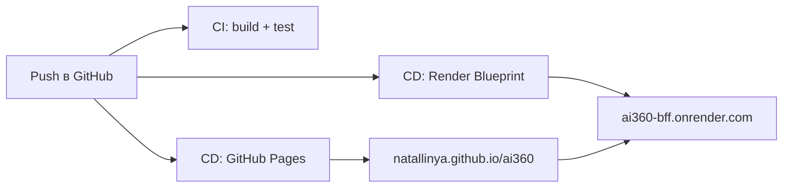

# CI/CD и деплой ai360

Пэт-проект выкладывается в два места:

| Часть | Хостинг | URL после настройки |
|-------|---------|---------------------|
| **web** (Angular) | GitHub Pages | https://natallinya.github.io/ai360/ |
| **api** (BFF) | Render (free) | https://ai360-bff.onrender.com |

## Что уже настроено в репозитории

- **`.github/workflows/ci.yml`** — на каждый push/PR: сборка `api` + `web`, тесты Angular.
- **`.github/workflows/deploy.yml`** — на push в `main` / `development`: деплой фронта на GitHub Pages.
- **`render.yaml`** — blueprint для автодеплоя BFF на Render при push.



---

## Один раз: включить GitHub Pages

1. Откройте https://github.com/Natallinya/ai360/settings/pages
2. **Source** → **GitHub Actions** (не «Deploy from branch»).
3. Сохраните.

После первого успешного `Deploy` workflow появится живая ссылка.

---

## Один раз: подключить Render (BFF)

1. https://dashboard.render.com → **New** → **Blueprint**
2. Подключите репозиторий `Natallinya/ai360`, ветка `development`.
3. Render прочитает `render.yaml` и создаст сервис **ai360-bff**.
4. Дождитесь зелёного деплоя, откройте URL сервиса.
5. Проверка: `GET https://ai360-bff.onrender.com/api/health` → `{"status":"ok",...}`.

**Free tier:** сервис «засыпает» после простоя; первый запрос может занять 30–60 с.

### Секреты на Render (опционально)

В Render → сервис **ai360-bff** → **Environment**:

| Переменная | Зачем |
|------------|--------|
| `OPENAI_API_KEY` | DALL·E для гибридов вместо Stable Horde |
| `STABLE_HORDE_API_KEY` | Быстрее очередь генерации картинок |
| `CORS_ORIGINS` | Доп. домены через запятую (GitHub Pages уже в дефолте) |

---

## Один раз: переменная GitHub (URL API)

Если URL BFF на Render **не** `https://ai360-bff.onrender.com`:

1. https://github.com/Natallinya/ai360/settings/variables/actions
2. **New repository variable**
3. Name: `API_BASE_URL`, Value: `https://ваш-сервис.onrender.com` (без слэша в конце).

При следующем деплое фронт подставит этот URL в `environment.prod.ts`.

---

## Опционально: защита ветки

https://github.com/Natallinya/ai360/settings/branches → **Add rule** для `development`:

- ✅ Require status checks to pass — выберите **CI / build-and-test**
- ✅ Require pull request before merging (по желанию)

Тогда в `development` не попадёт код с красным CI.

---

## Локальная проверка перед push

```powershell
cd D:\projects\ai360
npm ci
npm run build
npm test
npm run build:pages
```

`build:pages` собирает фронт как для GitHub Pages (`/ai360/` + URL Render API).

---

## Ограничения на проде

| Функция | Локально | Прод |
|---------|----------|------|
| Поиск mock / WB / DummyJSON | ✅ | ✅ |
| Гибриды (Stable Horde) | ✅ | ✅ (медленнее на free Render) |
| Импорт по URL (Playwright) | ✅ | ⚠️ на Render free часто нестабильно |
| WB/Ozon антибот | как и локально | как и локально |

Для доклада надёжнее показывать: поиск, вишлист, гибриды, тестовую ссылку books.toscrape.

---

## Полезные ссылки

- Actions: https://github.com/Natallinya/ai360/actions
- Pages: https://github.com/Natallinya/ai360/settings/pages
- Variables: https://github.com/Natallinya/ai360/settings/variables/actions
